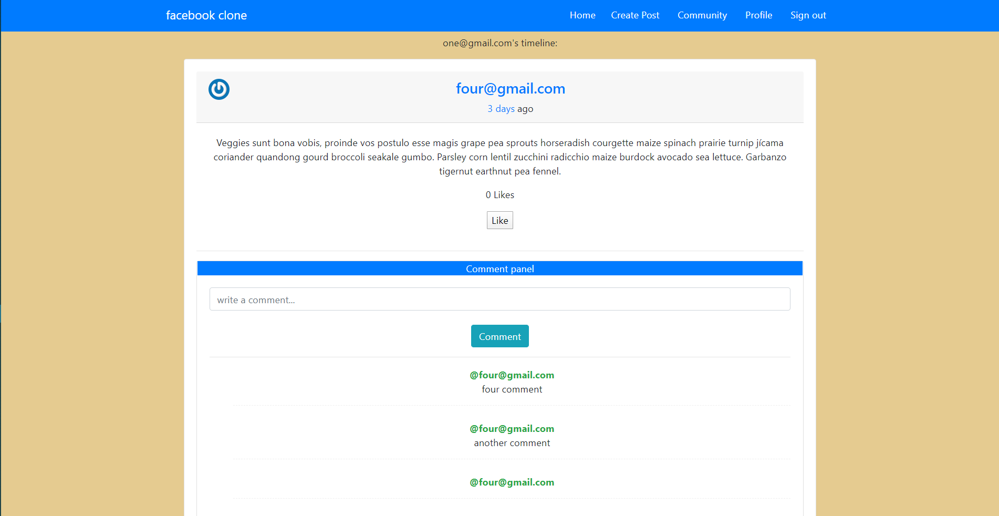

# Ruby on Rails Facebook-Clone Application

> The project consisted of creating a social network similar to Facebook. With the implementation of Facebook's main functionalities.

## Summary description of the project and its features
**A user can:**
1. See all users list.
2. See selected user page with their user name and all posts written by them (the most recent posts on the top).
3. Send a friendship invitation.
4. See a button “Invite to friendship” next to the name of the user who is not my friend yet - on both users’ list and single-user page.
5. See pending friendship invitations sent to me from other users.
6. Be able to accept or reject friendships invitation.
7. Be able to create new posts (text only).
8. Be able to like/dislike posts (but I can like a single post only once).
9. Be able to add comments to posts.
10. Be able to see the “Timeline” page with posts (with several likes and comments) written by me and all my friends (the most recent posts on the top).

- Timeline page is the root page of the app.




## Built With

- **Major languages:** *Ruby, JavaScript & CSS,*
- **Frameworks:** *Ruby on Rails (RoR), Sass, & Bootstrap,*
- **Technologies used:** *git, PostgreSQL, Heroku, GitHub.*
- **Methodologies:** *TDD & BDD (with RSpec), Love & Passion*
- **Editors:** *VSCode*
- **Browser:** *Chrome*

## Live Demo

[The App](https://afternoon-fortress-90229.herokuapp.com/)

## Getting Started

> **If you want to check out the working of the code in your local machine, first off, you need to clone this repo and install the required dependencies in your system. The instructions to do this are listed below:**
>> To get a local copy up and running follow these simple example steps.
***

## Prerequisites

>We are using rbenv as our environment.
> 1. rbenv version:~> 1.1.2-20-
> 2. Ruby version: ~> 2.6.5
> 3. Rails knowledge.
> 4. git knowledge.
> 5. PostgreSQL database installed in the local machine.

***
## Future features or updates/improvements
- The upcoming updates will consist of:
1. A revamped User login and logout interface, for easy manoeuvring.
2. A Share option for posts on the site and more improved User interface for the platform.
3. A sign in with other social media accounts in addition to Facebook and email, and a way to edit user profiles. 
-
### Setup

```git clone git@github.com:ChristianOtieno/rails-facebook.git```
***

### Install

1.```bundle install```

2.```rails db:create```

3.```rails db:migrate```
***

### Usage

```rails server```
***

### Run tests

```rspec```
***

## Authors

👤 **Christian Otieno**

- Github: [@ChristianOtieno](https://github.com/ChristianOtieno)
- Twitter: [@iamchrisotieno](https://twitter.com/iamchrisotieno)
- Linkedin: [Christian Otieno](https://www.linkedin.com/in/christianotieno/)

👤 **Tommy Montana**

- Github: [@TommyM0ntana](https://github.com/TommyM0ntana)
- Twitter: [@tommymo13761893](https://twitter.com/tommymo13761893)
- Linkedin: [Tommy Montana](https://www.linkedin.com/in/tommy-h-montana/)

## Project specifications

You can find project specifications [here](https://www.theodinproject.com/courses/ruby-on-rails/lessons/final-project)

## 🤝 Contributing

Contributions, issues and feature requests are welcome!

Feel free to check the [issues page](https://github.com/ChristianOtieno/rails-facebook/issues).

## Show your support

Give a ⭐️ if you like this project!

## Acknowledgments

- Microverse.

## 📝 License

This project is [MIT](https://opensource.org/licenses/MIT) licensed.
